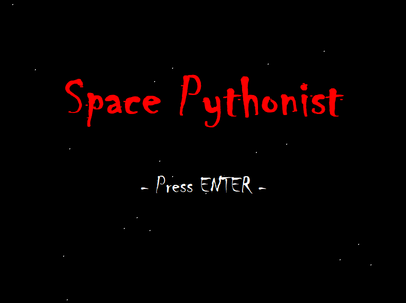

# Space Pythonist

Simple SF shooter based on *Taito Corporation(タイトー株式会社)'s* **Space Invaders(スペースインベーダー)** format.  

## Game Preview



### Prerequisites

```
python 3+ 
tkinter
```

## How to play

```
$ git clone https://www.github.com/sheepjin99/Space_Pythonist
$ cd <directory_where_you_cloned/Space_Pythonist>
$ python game.py
```
Press **Enter key** to start game & **Space key** to shoot bullets.

## For macOS & Linux Users

This game use font named **'Chiller'**, but macOS & other Linux doesn't have chiller font at all.  
So I suggest to install it with ttf file **[here](https://fontzone.net/font-details/chiller)**

## Built With

* [Tkinter](https://en.wikipedia.org/wiki/Tkinter) - Python GUI module
* [leerob/Space_Invaders](https://github.com/leerob/Space_Invaders) - Got alien images from this repository

