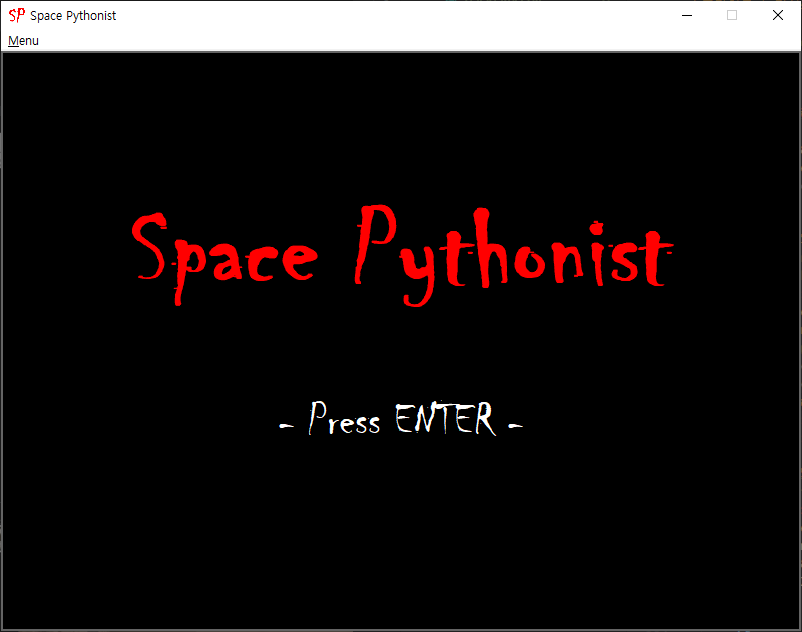
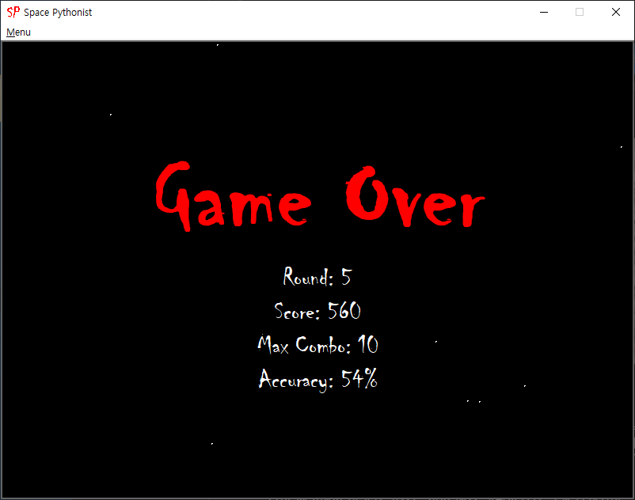

# Space Pythonist

Simple classic sf shooter game based on Taito Corporation(タイトー株式会社)'s Space Invaders(スペースインベーダー) format.  

## Screenshots

* Game Screen


* Initial Screen


* Game Over


### Prerequisites

```
python 3
tkinter
```

### How to play

```
$ cd Space_pythonist
$ python3 game.py
```

## Built With

* [Tkinter](https://en.wikipedia.org/wiki/Tkinter) - Python GUI module
* [leerob/Space_Invaders](https://github.com/leerob/Space_Invaders) - Got alien images from this repository

## Authors

* **Yangjin Cho** - [Github](https://github.com/sheepjin99) / [Twitter](https://twitter.com/Kraint_Dev) / [Facebook](https://www.facebook.com/profile.php?id=100014648160911) / [Blog](https://sheepjin99.tistory.com)

See also the list of [contributors](https://github.com/your/project/contributors) who participated in this project.

## License

This project is licensed under the MIT License - see the [LICENSE.md](LICENSE.md) file for details

